## 项目概述
**项目名称：** B2B自动化航司机票处理程序  
**项目描述：** 开发了一套完整的自动化机票处理系统，涵盖航司登录、机票查询、预订、支付全流程及发票开具功能，替代传统人工操作，大幅提升处理效率。

## 技术栈

### 后端技术
- **编程语言：** Java
- **Web框架：** Spring Boot
- **HTTP客户端：** Apache HttpClient
- **配置管理：** Spring配置文件(YAML/Properties)
- **日志框架：** SLF4J + Logback
- **加密算法：** AES、SHA256等安全加密算法

### 自动化技术
- **浏览器自动化：** Selenium WebDriver
- **JavaScript引擎：** Rhino JS Engine
- **网页抓取：** 自定义爬虫框架
- **页面交互：** Web元素识别与操作

### 数据处理
- **数据传输对象(DTO)：** 定义标准化请求响应模型
- **枚举类型：** FlightType、TicketType、OrderStatus等业务枚举
- **JSON序列化：** Jackson或Gson处理数据交换

### 测试框架
- **单元测试：** JUnit
- **集成测试：** 基于Spring Test的自动化测试

### 架构设计
- **分层架构：** Controller -> Service -> Spider层
- **配置中心：** Spring配置管理不同航空公司属性
- **异常处理：** 统一异常处理机制
- **多线程/连接池：** WebDriver连接池管理

## 主要功能模块

### 1. 航司登录模块
- 实现多航司登录认证机制
- Cookie管理和会话保持
- 登录状态监控和异常处理

### 2. 机票查询与预订模块
- 航班信息检索和筛选
- 价格比较和展示
- 订单创建和PNR管理

### 3. 支付处理模块
- 多种支付渠道集成
- 支付状态跟踪
- 支付结果确认

### 4. 发票开具模块
- 行程单自动生成
- OFD发票文件下载
- 发票状态管理

## 工作流程

### 1. 系统初始化
1. 启动Spring Boot应用
2. 初始化WebDriver连接池
3. 加载各航司配置参数
4. 配置HTTP客户端和加密工具

### 2. 用户请求处理
1. 接收前端API请求（查询、预订、支付等）
2. 验证请求参数和用户身份
3. 根据航司类型路由到对应爬虫实现
4. 执行自动化浏览器操作

### 3. 浏览器自动化流程
1. 启动预配置的WebDriver实例
2. 导航至目标航司网站
3. 执行登录认证流程
4. 填充查询条件并获取航班列表
5. 选择合适航班并填写乘客信息
6. 提交订单并处理支付流程

### 4. 数据处理与返回
1. 解析网页响应数据
2. 提取关键信息（航班号、时间、价格等）
3. 封装成标准DTO对象
4. 返回给调用方

### 5. 异常处理机制
1. 监控自动化流程中的异常
2. 捕获网络错误、超时等异常
3. 实现重试机制和降级策略
4. 记录详细日志便于问题排查

## 核心技术实现

### 1. 自动化爬虫框架
- 设计了通用[ISpider](ISpider)接口，支持多种航司实现
- 实现了[CASpider](CASpider)、[CZSpider](CZSpider)、[HuSpider](HuSpider)等具体航司实现
- 集成了验证码识别和复杂表单处理功能

### 2. 安全机制
- 实现了[AES加密](AESEncryptor)和[SHA256摘要算法](SHA256Digest)
- 使用Cookie管理维持登录状态
- 实现敏感信息加密存储

### 3. 连接池管理
- 设计了[WebDriver连接池](ProfileWebDriverPoolManager)提高资源利用率
- 实现端口管理和资源回收机制

## 详细工作流程图

```mermaid
graph TD
    A[用户发起请求] --> B{解析请求类型}
    B -->|登录| C[执行航司登录流程]
    B -->|查询| D[执行航班查询]
    B -->|预订| E[执行预订流程]
    B -->|支付| F[执行支付流程]
    B -->|发票| G[执行发票开具]
    
    C --> C1[获取WebDriver实例]
    C1 --> C2[导航至航司网站]
    C2 --> C3[输入登录凭证]
    C3 --> C4[处理验证码]
    C4 --> C5[提交登录表单]
    C5 --> C6[验证登录状态]
    
    D --> D1[准备查询参数]
    D1 --> D2[填充查询表单]
    D2 --> D3[提交查询请求]
    D3 --> D4[解析航班列表]
    D4 --> D5[提取航班信息]
    
    E --> E1[选择航班]
    E1 --> E2[填写乘客信息]
    E2 --> E3[提交预订表单]
    E3 --> E4[获取订单信息]
    
    F --> F1[获取支付渠道]
    F1 --> F2[选择支付方式]
    F2 --> F3[执行支付流程]
    F3 --> F4[验证支付结果]
    
    G --> G1[获取票号信息]
    G1 --> G2[申请发票开具]
    G2 --> G3[获取OFD下载链接]
    
    C6 --> H[返回响应结果]
    D5 --> H
    E4 --> H
    F4 --> H
    G3 --> H
    
    C --> I[异常处理]
    D --> I
    E --> I
    F --> I
    G --> I
    I --> H
```



## 相关技术代码实现示例

### 1. 爬虫接口定义
```java
public interface ISpider {
    // 登录功能
    String login(LoginRequest request);
    
    // 航班搜索
    List<FlightInfo> searchFlights(SearchRequest request);
    
    // 创建订单
    OrderInfo createOrder(CreateOrderRequest request, String token);
    
    // 支付功能
    PayChannelOrder getPayChannel(String orderId, String token);
    
    // 发票功能
    String getInvoiceUrl(String ticketNumber, String token);
}
```

### 2. WebDriver连接池管理
```java
@Component
public class ProfileWebDriverPoolManager {
    private final Map<String, Object> lock = new ConcurrentHashMap<>();
    private final Map<String, PooledWebDriver> pool = new ConcurrentHashMap<>();
    
    public PooledWebDriver acquireWebDriver(String profile) {
        // 获取可用WebDriver实例
    }
    
    public void releaseWebDriver(PooledWebDriver driver) {
        // 释放WebDriver实例回池
    }
}
```

### 3. HTTP客户端安全通信
```java
@Component
public class CustomHttpClient {
    public <T> T postJson(String url, Object requestBody, Class<T> responseType) {
        // AES加密请求数据
        // 发送HTTPS请求
        // 解密响应数据
    }
}
```

## 简历技术总结

负责开发B2B自动化航司机票处理系统，采用Java+Spring Boot架构，集成Selenium WebDriver实现浏览器自动化操作。设计并实现了多航司机票查询、预订、支付及发票开具的完整流程，通过WebDriver连接池优化资源利用，结合AES加密保障数据安全。运用分层架构模式，实现[ISpider](ISpider)接口适配不同航司网站，显著提升机票处理效率，降低人工操作成本。

## 项目成果
- 实现了对多家主流航司机票预订流程的自动化
- 显著提升了机票处理效率，减少人工操作成本
- 建立了稳定可靠的自动化处理系统
- 支持高并发订单处理能力
