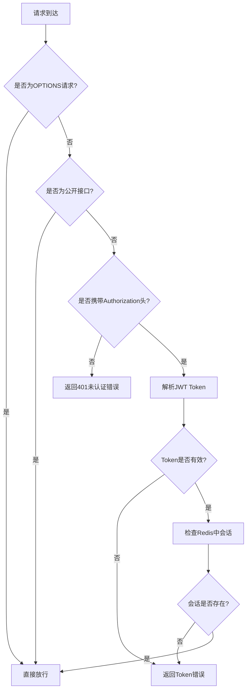

# 📝 博客项目笔记
                               **-zpy**

>对原先的前端进行了修改，前后端源码一并去我的github自取：https://github.com/ZhangPeiyangXD    
欢迎QQ交流学习：
3027578745
     

      
## 🗂️ 项目结构

```
blog-parent
├── blog-api
│   ├── src/main/java/com/itzpy/blog
│   │   ├── aop                    # 面向切面编程相关
│   │   ├── config                 # 配置类
│   │   ├── controller             # 控制层
│   │   ├── dao                    # 数据访问层
│   │   │   ├── dos                # 数据传输对象
│   │   │   ├── mapper             # MyBatis映射接口
│   │   │   └── pojo               # 持久化对象
│   │   ├── handler                # 全局异常处理器
│   │   ├── interceptor            # 拦截器
│   │   ├── service                # 业务逻辑层
│   │   │   └── impl               # 业务逻辑实现
│   │   ├── utils                  # 工具类
│   │   ├── vo                     # 视图对象
│   │   │   ├── params             # 请求参数对象
│   │   │   └── vo                 # 响应视图对象
│   │   └── BlogApp.java          # 应用启动类
│   └── src/main/resources         # 资源文件
│       ├── com/itzpy/blog         # MyBatis XML映射文件
│       │   ├── dao/mapper         # Mapper XML文件
│       │   └── markdown           # Markdown文档
│       └── application.yml        # 应用配置文件
└── pom.xml                       # Maven配置文件
```

## 🧩 功能模块

### 🔐 用户认证模块
- 登录 `/login`
- 注册 `/register`
- 登出 `/logout`
- JWT Token验证

### 📰 文章模块
- 文章列表 `/articles`
- 文章详情 `/articles/{id}`
- 热门文章 `/articles/hot`
- 最新文章 `/articles/new`
- 文章归档 `/articles/listArchives`
- 发布文章 `/articles/publish`
- 删除文章 `/articles/delete/{id}`
- 修改文章 `/articles/change/{id}`

### 💬 评论模块
- 评论列表 `/comments/article/{id}`
- 发表评论 `/comments/create/change`

### 🏷️ 标签模块
- 热门标签 `/tags/hot`
- 所有标签 `/tags`
- 标签详情 `/tags/detail`
- 标签详情(根据ID) `/tags/detail/{id}`

## 🛠️ 技术栈

| 技术           | 版本    | 用途 |
|--------------|-------|------|
| JDK          | 1.8   | 编程语言 |
| Spring Boot  | 2.7.3 | 应用框架 |
| MyBatis Plus | 3.4.3 | ORM框架 |
| MySQL        | 8.0   | 数据库 |
| Redis        | -     | 缓存/会话管理 |
| JWT          | -     | Token认证 |
| FastJSON     | -     | JSON处理 |
| Maven        | -     | 项目构建 |
| Lombok       | -     | 简化Java代码 |
| AOP          | -     | 面向切面编程 |
| SLF4J        | -     | 日志框架 |

## ⚙️ 核心配置

### application.yml

```yaml
server:
  port: 8888

spring:
  application:
    name: zpy_blog
  # 数据库（要配置数据库字符集为utf8mb4，这样子可以适配emoj表情）
  datasource:
    url: jdbc:mysql://localhost:3306/blog?useUnicode=true&characterEncoding=UTF-8&serverTimeZone=UTC
    username: root
    password: 1234
    driver-class-name: com.mysql.cj.jdbc.Driver
    hikari:
      connection-init-sql: SET NAMES utf8mb4 COLLATE utf8mb4_unicode_ci
  # 数据库连接字符集配置
  database-platform: org.hibernate.dialect.MySQL5InnoDBDialect
  # 文件上传
  servlet:
    multipart:
      max-request-size: 20MB
      max-file-size: 3MB
  # redis
  redis:
    host: localhost
    port: 6379
    database: 2


mybatis-plus:
  configuration:
    map-underscore-to-camel-case: true
  mapper-locations: classpath*:com/itzpy/blog/dao/mapper/*.xml
  type-aliases-package: com.itzpy.blog.dao.pojo

# 七牛云配置
qiniu:
  accessKey: your_access_key
  accessSecretKey: your_secret_key

# JWT 自定义配置
jwt:
  token-expiration: 86400000  # 24小时毫秒数 (24 * 60 * 60 * 1000)
  secret: zpy_blog            # JWT 密钥
  salt: zpy_blog              # 加密盐值

# AuthorId自定义：
authorId: 1234

# 热门标签数量配置
hot:
  tag:
    num: 6
```

## 🔍 核心代码分析

### 🌐 WebMVC配置

```java
@Configuration
public class WebMVCConfig implements WebMvcConfigurer {
    
    @Autowired
    private LoginInterceptor loginInterceptor;
    
    @Override
    public void addCorsMappings(CorsRegistry registry) {
        // 跨域配置
        registry.addMapping("/**")
                .allowedOrigins("http://localhost:8080")
                .allowedMethods("GET", "POST", "PUT", "DELETE", "OPTIONS")
                .allowedHeaders("*")
                .allowCredentials(true);
    }

    //添加自定义拦截器，用于处理登录和JWT验证逻辑
    @Override
    public void addInterceptors(InterceptorRegistry registry) {
        // 添加自定义拦截器，用于处理登录和JWT验证逻辑
        registry.addInterceptor(loginInterceptor)
                .addPathPatterns("/**")  // 拦截所有请求
                .excludePathPatterns("/login**", "/register",
                        "/articles", "/articles/hot", "/articles/new", "/articles/listArchives",
                        "/articles/view/**",
                        "/tags/**",
                        "/comments/**",
                        "/categorys/**",
                        "/users/currentUser");
    }
}
```

### 🔒 登录拦截器

登录拦截器是项目的安全核心组件，负责验证用户身份和权限控制。

```java
@Component
public class LoginInterceptor implements HandlerInterceptor {
    
    @Autowired
    private JWTUtils jwtUtils;
    
    @Autowired
    private RedisTemplate<String, String> redisTemplate;

    @Autowired
    private LoginService loginService;

    /**
     * 请求处理之前执行
     * @param request 请求对象
     * @param response 响应对象
     * @param handler 处理器对象
     * @return true表示继续处理请求，false表示拒绝处理请求
     * @throws Exception 抛出的异常
     */
    @Override
    public boolean preHandle(HttpServletRequest request, HttpServletResponse response, Object handler) throws Exception {
        String uri = request.getRequestURI();
        
        // 处理OPTIONS预检请求
        if ("OPTIONS".equalsIgnoreCase(request.getMethod())) {
            return true;
        }

        // 处理一些公开接口，不需要token验证
        if (uri.equals("/register") ||
            uri.equals("/login")||
            uri.equals("/comments/create/change")
            ) {
            return true;
        }

        // 检查是否携带JWT token
        String authorizationHeader = request.getHeader("Authorization");
        if (authorizationHeader != null && authorizationHeader.startsWith("Bearer ")) {
            // 验证JWT token并检查Redis中是否存在对应的用户信息
            String token = authorizationHeader.substring(7);
            // 检查token是否为空或无效
            if (StringUtils.isBlank(token)) {
                response.setContentType("application/json;charset=utf-8");
                response.setStatus(HttpServletResponse.SC_UNAUTHORIZED);
                response.getWriter().print(JSON.toJSONString(Result.fail(ErrorCode.TOKEN_ERROR.getCode(), ErrorCode.TOKEN_ERROR.getMsg())));
                return false;
            }
            
            Result result = validateJwtTokenAndCheckRedis(token);
            if (result != null) {
                // token验证失败，返回错误信息
                response.setContentType("application/json;charset=utf-8");
                response.getWriter().print(JSON.toJSONString(result));
                return false;
            }
            
            // 登录成功时，从Redis中获取用户信息并存储到UserThreadLocal中
            String userJson = redisTemplate.opsForValue().get("TOKEN_" + token);
            if (!StringUtils.isBlank(userJson)) {
                try {
                    SysUser sysUser = JSON.parseObject(userJson, SysUser.class);
                    if (sysUser != null) {
                        UserThreadLocal.put(sysUser);
                    }
                } catch (Exception e) {
                    // 解析用户信息失败，继续执行但不存储用户信息
                }
            }

            // 放行
            return true;
        }

        // 如果既不是登录/注册请求又没有有效的JWT，则拒绝访问
        response.setContentType("application/json;charset=utf-8");
        response.setStatus(HttpServletResponse.SC_UNAUTHORIZED);
        response.getWriter().print(JSON.toJSONString(Result.fail(ErrorCode.NO_LOGIN.getCode(), ErrorCode.NO_LOGIN.getMsg())));
        return false;
    }

    /**
     * 验证JWT token并检查Redis中是否存在对应的用户信息
     * @param token JWT token
     * @return 如果验证失败返回Result对象，否则返回null表示验证成功
     */
    private Result validateJwtTokenAndCheckRedis(String token) {
        // 检查token是否为空
        if (StringUtils.isBlank(token)) {
            return Result.fail(ErrorCode.TOKEN_ERROR.getCode(), ErrorCode.TOKEN_ERROR.getMsg());
        }

        // 检查jwtUtils是否为null
        if (jwtUtils == null) {
            return Result.fail(ErrorCode.SYSTEM_ERROR.getCode(), "JWT工具初始化失败");
        }

        // 验证JWT token
        Map<String, Object> tokenMap = jwtUtils.checkToken(token);
        if (tokenMap == null) {
            return Result.fail(ErrorCode.TOKEN_ERROR.getCode(), ErrorCode.TOKEN_ERROR.getMsg());
        }

        // 检查redisTemplate是否为null
        if (redisTemplate == null) {
            return Result.fail(ErrorCode.SYSTEM_ERROR.getCode(), "Redis模板初始化失败");
        }

        // 检查Redis中是否存在对应的用户信息（验证用户是否已登出）
        try {
            String userJson = redisTemplate.opsForValue().get("TOKEN_" + token);
            if (StringUtils.isBlank(userJson)) {
                return Result.fail(ErrorCode.TOKEN_ERROR.getCode(), ErrorCode.TOKEN_ERROR.getMsg());
            }

            // 尝试解析用户信息
            SysUser sysUser = JSON.parseObject(userJson, SysUser.class);
            if (sysUser == null) {
                return Result.fail(ErrorCode.TOKEN_ERROR.getCode(), ErrorCode.TOKEN_ERROR.getMsg());
            }
        } catch (Exception e) {
            return Result.fail(ErrorCode.TOKEN_ERROR.getCode(), ErrorCode.TOKEN_ERROR.getMsg());
        }

        // 验证成功
        return null;
    }

    /**
     * 请求处理完成后执行（删除用户线程，防止内存泄漏）
     * @param request 请求对象
     * @param response 响应对象
     * @param handler 处理器对象
     * @param ex 异常对象
     * @throws Exception 抛出的异常
     */
    @Override
    public void afterCompletion(HttpServletRequest request, HttpServletResponse response, Object handler, Exception ex) throws Exception {
        // 请求处理完成后，清空当前线程中的用户信息
        UserThreadLocal.remove();
    }
}
```

#### 🛡️ 安全机制

拦截器使用双重验证机制确保安全性：
1. **JWT验证**：使用JWT工具类验证Token的签名和有效期
2. **Redis会话验证**：检查Redis中是否存在对应的用户会话信息

只有两个验证都通过，才认为用户身份有效。

### 💬 评论服务实现

评论服务负责处理文章评论的创建和查询。

```java
@Service
public class CommentServiceImpl implements CommentService {
    
    @Autowired
    private CommentMapper commentMapper;
    
    @Autowired
    private ArticleMapper articleMapper;
    
    @Autowired
    private SysUserService sysUserService;

    @Value("${authorId}")
    private Long authorId;

    /**
     * 创建评论
     * @param commentParam 评论参数
     * @return result(评论结果)
     */
    @Override
    public Result create(CommentParam commentParam) {
        // 检查参数
        if (commentParam == null || commentParam.getContent() == null || commentParam.getArticleId() == null) {
            return Result.fail(ErrorCode.PARAMS_ERROR.getCode(), ErrorCode.PARAMS_ERROR.getMsg());
        }
        
        // 构造评论对象
        Comment comment = new Comment();
        comment.setArticleId(commentParam.getArticleId());
        comment.setContent(commentParam.getContent());
        comment.setCreateDate(System.currentTimeMillis());
        
        // 设置作者ID，如果用户已登录则使用登录用户ID，否则使用默认匿名用户ID
        SysUser currentUser = UserThreadLocal.get();
        if (currentUser != null) {
            comment.setAuthorId(currentUser.getId());
        } else {
            // 匿名用户发表评论，使用默认作者ID (例如系统管理员ID)
            comment.setAuthorId(authorId);
        }
        
        // 判断是评论文章还是一级评论
        if (commentParam.getParent() == null || commentParam.getParent() == 0) {
            // 评论文章
            comment.setLevel(1);
        } else {
            // 回复评论
            comment.setParentId(commentParam.getParent());
            comment.setToUid(commentParam.getToUserId());
            comment.setLevel(2);
        }
        
        // 插入评论到数据库
        int insertResult = commentMapper.insertComment(comment);
        if (insertResult != 1) {
            return Result.fail(ErrorCode.SYSTEM_ERROR.getCode(), ErrorCode.SYSTEM_ERROR.getMsg());
        }
        
        // 更新文章的评论数
        articleMapper.updateCommentCount(commentParam.getArticleId());
        
        // 转换为CommentVo返回
        CommentVo commentVo = copy(comment);
        return Result.success(commentVo);
    }
}
```

#### 🔄 评论结构设计

评论系统采用两级结构：
- 一级评论：直接对文章的评论
- 二级评论：对一级评论的回复

数据库表结构：
```sql
CREATE TABLE comment (
    id BIGINT PRIMARY KEY,
    content TEXT NOT NULL,
    create_date BIGINT NOT NULL,
    article_id BIGINT NOT NULL,
    author_id BIGINT NOT NULL,
    parent_id BIGINT DEFAULT NULL,
    to_uid BIGINT DEFAULT NULL,
    level INT NOT NULL
);
```

# 🧪 博客项目开发笔记 📝

> 🛠️ **开发提示**: 开发时使用1-3的那个前端文件，不要用上线的，因为后面对项目，数据库的表都有优化。

---

## 1. 前置知识 ⚙️

- Spring Boot
- Spring MVC
- MyBatis Plus 或者 MyBatis，我个人用的是MyBatis实现对应接口

> 💡 **小贴士**: 这样基本能做到看了接口文档需求自己实现对应的功能。  
> 比一味的抄代码效率和体验好很多。

---

## 2. 项目配置相关 🔧

1. 使用老师的JDK版本和对应版本的依赖项
2. 包、类的路径注意和扫描的路径相同（mapper.xml映射的时候）
3. 确保MyBatis配置正确，mapper-locations路径与实际文件路径一致

---

## 3. JWT相关 🔐

1. 使用jwt工具类创建jwt的token令牌
2. ⚠️ **重要提醒**: 注意直接给数据库插入用户账密数据的时候，回车键也会被插入（找了半个小时，我还以为是加密出错了）

### 3.1 JWT工具类实现

JWT工具类负责生成和验证JWT令牌，是整个认证系统的核心组件。

```java
@Component
public class JWTUtils {
    
    @Value("${jwt.secret}")
    private String secret;
    
    @Value("${jwt.token-expiration}")
    private Long expiration;
    
    @Value("${jwt.salt}")
    private String salt;

    /**
     * 生成JWT token
     * @param claims 要包含在token中的声明
     * @return 生成的token字符串
     */
    public String generateToken(Map<String, Object> claims) {
        // 设置过期时间
        Date expirationDate = new Date(System.currentTimeMillis() + expiration);
        
        // 生成token
        return Jwts.builder()
                .setClaims(claims)
                .setExpiration(expirationDate)
                .signWith(SignatureAlgorithm.HS512, secret)
                .compact();
    }

    /**
     * 验证JWT token
     * @param token 要验证的token
     * @return 如果验证成功返回包含声明的Map，否则返回null
     */
    public Map<String, Object> checkToken(String token) {
        try {
            // 解析token
            Claims claims = Jwts.parser()
                    .setSigningKey(secret)
                    .parseClaimsJws(token)
                    .getBody();
            
            // 检查是否过期
            if (claims.getExpiration().before(new Date())) {
                return null;
            }
            
            return claims;
        } catch (Exception e) {
            return null;
        }
    }
    
    /**
     * 从token中获取用户ID
     * @param token JWT token
     * @return 用户ID
     */
    public Long getUserIdFromToken(String token) {
        Map<String, Object> claims = checkToken(token);
        if (claims != null) {
            return Long.valueOf(claims.get("id").toString());
        }
        return null;
    }
}
```

### 3.2 JWT配置说明

在 [application.yml](file:///D:/blog_learn/myBlog/blog-parent/blog-api/src/main/resources/application.yml) 中配置JWT相关信息：

```yaml
# JWT 自定义配置
jwt:
  token-expiration: 86400000  # 24小时毫秒数 (24 * 60 * 60 * 1000)
  secret: zpy_blog            # JWT 密钥
  salt: zpy_blog              # 加密盐值
```

### 3.3 JWT使用流程

1. **用户登录**：验证用户名和密码，生成JWT token并返回给前端
2. **前端存储**：前端将token存储在localStorage或sessionStorage中
3. **请求携带**：每次请求时在Authorization头中携带token（格式：Bearer token）
4. **后端验证**：拦截器验证token的有效性和时效性
5. **用户登出**：从Redis中删除对应的token信息，使token失效

---

## 4. 拦截器配置相关 🚧

### 4.1 创建拦截器
创建拦截器类，实现HandlerInterceptor接口

### 4.2 注册拦截器
在WebMvcConfig中注册拦截器

### 4.3 实现拦截逻辑

#### 处理OPTIONS预检请求
```
if ("OPTIONS".equalsIgnoreCase(request.getMethod())) {
    return true;
}
```

✅ **添加了必要的依赖注入**:
- 注入了JWTUtils用于JWT token验证
- 注入了RedisTemplate用于检查Redis中的用户信息

✅ **完善了token验证逻辑**:
- 不仅验证JWT token的有效性，还检查Redis中是否存在对应的用户信息
- 这样可以确保用户登录后、登出前才能访问受保护的资源
- 如果用户已登出（Redis中的token被删除），即使JWT token本身有效也无法访问

✅ **添加了@Component注解**:
- 使拦截器能够通过Spring进行依赖注入

---

## 5. 登录相关 🔒

1. 登录时候获取用户信息，创建一个currentUser方法，接收token参数
2. 从客户端发送的HTTP请求头中获取名为Authorization的字段值，并将其作为token参数传入currentUser方法中，获取用户信息并返回给前端。注意WebMvcConfig配置中跨域配置，允许跨域请求
3. 创建LoginInterceptor拦截器并在WebMvcConfig注册
4. ✅ **注意放行以下请求路径**:
    - `/login/**`
    - `/articles/**` 和 `/articles`
    - `/tags/hot`
    - `/users/currentUser`
    - `/register`

---

## 6. 跨域配置 🌐

在WebMvcConfig中配置CORS：
- ✅ 允许来自`http://localhost:8080`的请求
- ✅ 允许GET、POST、PUT、DELETE、OPTIONS方法
- ✅ 允许所有请求头
- ✅ 允许携带凭证

---

## 7. 错误处理 ⚠️

统一使用Result对象返回错误信息，避免直接返回null或简单字符串，确保前后端数据交互的一致性。

---

## 8. 账户注册时的动态插入sql 💾

```xml
<insert id="insertSelective">
  insert into 表名
  <trim prefix="(" suffix=")" suffixOverrides=",">
    <if test="account != null"> account, </if>
    ...
  </trim>
  <trim prefix="values (" suffix=")" suffixOverrides=",">
    <if test="account != null"> #{account}, </if>
    ...
  </trim>
</insert>
```

其中，`<trim>`标签用于去除多余的逗号，`<if>`标签用于判断字段是否为空，不为空则插入该字段的值。

### `<trim>` 标签属性详解：

| 属性 | 作用 | 示例 |
|------|------|------|
| `prefix` | 在 SQL 语句的开头添加指定的内容 | `prefix="("` 会在 SQL 开头添加左括号 |
| `suffix` | 在 SQL 语句的结尾添加指定的内容 | `suffix=")"` 会在 SQL 结尾添加右括号 |
| `prefixOverrides` | 去除 SQL 语句开头的指定字符 | `prefixOverrides="AND "` 会去除 SQL 开头的 "AND " 字符串 |
| `suffixOverrides` | 去除 SQL 语句结尾的指定字符 | `suffixOverrides=","` 会去除 SQL 结尾的逗号 |

> ⚠️ **重要提醒**: 我在实现账户注册时，产生token和保存redis使用的方法是调用登录的login方法。  
> 这就导致我忘记了密码被加密的问题，导致在查表的时候一直找不到对应账户。

---

## 9. 拦截器相关：（这个项目前端有问题，拿不到请求头中的token，直接全部接口放行）

### 9.1 拦截器设计思路 🧠

拦截器是整个博客系统安全认证的核心组件，主要负责验证用户身份和权限控制。

#### 核心功能
1. **身份验证**：验证用户是否已登录
2. **权限控制**：控制哪些接口可以公开访问，哪些需要认证
3. **Token验证**：验证JWT Token的有效性
4. **会话管理**：通过Redis检查用户会话状态
5. **存储/删除用户信息**：存储用户信息到ThreadLocal中，在执行完一次请求后清除

#### 工作流程


#### 公开接口列表（这个项目前端有问题，拿不到请求头中的token，直接全部接口放行）
以下接口不需要认证即可访问：
- `/login` 开头的所有接口（登录相关）
- `/register` 注册接口
- `/articles` 和 `/articles/**` 文章列表相关接口
- `/tags/hot` 热门标签接口
- `/users/currentUser` 当前用户信息接口
- `/logout` 登出接口

### 9.2 拦截器实现细节 🔧

#### Token验证机制
拦截器使用双重验证机制确保安全性：
1. **JWT验证**：使用JWT工具类验证Token的签名和有效期
2. **Redis会话验证**：检查Redis中是否存在对应的用户会话信息

只有两个验证都通过，才认为用户身份有效。

#### 特殊请求处理
- **OPTIONS预检请求**：直接放行，确保跨域请求正常工作
- **公开接口**：配置了明确的路径排除规则，确保无需认证即可访问

---

### 9.3 安全性考虑 🔒

1. **防止重放攻击**：JWT Token有过期时间限制
2. **会话管理**：通过Redis存储会话信息，支持用户主动登出
3. **敏感信息保护**：密码等敏感信息在数据库中加密存储
4. **细粒度控制**：可以精确控制每个接口的访问权限

---

## 10. ThreadLocal存储用户信息以及防止内存泄漏 🧵

1. **流程**：在preHandle中设置用户信息，在afterCompletion中删除。
2. **ThreadLocal存储用户信息**：使用ThreadLocal存储用户信息（登陆成功后在需要登陆才能访问的路径中获取用户信息），从而避免了线程安全问题，每个线程都有自己的副本。
3. **防止内存泄漏**：使用remove语句，确保线程退出时自动清理ThreadLocal变量。

---

## 11. 查询文章详情 📖

### 11.1 所需 Mapper 组件

需要调用以下 Mapper 组件完成文章详情查询：
- ArticleMapper
- TagMapper
- ArticleBodyMapper
- CategoryMapper
- SysUserMapper

### 11.2 查询流程

查询流程相对简单，主要包括以下几个步骤：
1. 通过各 Mapper 查询相关数据
2. 将查询到的数据封装到对应的 VO 对象中
3. Author 信息只需包含 nickname，无需单独封装 VO
4. 最终将所有数据统一封装到 ArticleVo 中返回

### 11.3 阅读次数更新策略 ⚙️

#### 要求
- ✅ 更新阅读次数时需要加锁，防止并发问题
- ✅ 更新过程中出现问题不应影响用户阅读文章的主流程

#### 解决方案
采用异步处理方式，将阅读数更新操作放在线程池中执行，确保不影响用户的其他请求。

#### 实现细节
- 配置线程池，并在配置类上添加 `@EnableAsync` 注解
- 创建 ThreadService 服务类，将更新任务放在其方法中执行
- 通过 `@Async` 注解标记异步执行的方法

---

## 12. 评论系统实现 💬

### 12.1 评论数据结构设计

评论系统采用两级结构：
- 一级评论：直接对文章的评论
- 二级评论：对一级评论的回复

### 12.2 数据库表结构
```sql
CREATE TABLE comment (
                         id BIGINT PRIMARY KEY,
                         content TEXT NOT NULL,
                         create_date BIGINT NOT NULL,
                         article_id BIGINT NOT NULL,
                         author_id BIGINT NOT NULL,
                         parent_id BIGINT DEFAULT NULL,
                         to_uid BIGINT DEFAULT NULL,
                         level INT NOT NULL
);
```

### 12.3 后端实现要点

#### 评论查询逻辑
1. 首先查询文章的一级评论（level=1）
2. 然后为每个一级评论查询其二级评论（level=2）
3. 通过to_uid字段关联二级评论到对应的一级评论
4. 确保childrens字段不为null，当没有子评论时设置为空数组

#### 发表评论：
1. 创建评论对象，并设置属性
2. 允许匿名用户发表评论

#### 关键代码示例
```java
// 确保评论列表不为null
if (commentList == null) {
    commentList = new ArrayList<>();
}

// 确保childrens字段不为null
for (CommentVo parentComment : parentComments) {
    List<CommentVo> childComments = getChildComments(parentComment);
    if (childComments == null) {
        childComments = new ArrayList<>();
    }
    parentComment.setChildrens(childComments);
}
```

### 12.4 前端注意事项（课程中直接给到前端BlogView.vue有问题）

#### 前端处理null值
```javascript
// 在访问评论列表前检查是否存在
if (comments && comments.length > 0) {
    // 处理评论列表
}

// 在访问childrens前检查
if (comment.childrens && comment.childrens.length > 0) {
    // 处理子评论
}
```

#### Vue组件安全访问
```html
<!-- 使用v-if确保数据存在 -->
<div v-if="comment.childrens">
    <div v-for="child in comment.childrens" :key="child.id">
        {{ child.content }}
    </div>
</div>
```

---

## 13. 写文章相关 📝

### 13.1 前端源码问题：标签选择异常

#### 问题描述
在写文章页面选择标签时，点击一个标签会导致所有标签都被选中。

#### 核心修复点
Blog_Write.vue中:
最关键的变化是将 `t.tagName` 改为 `{{t.tagName}}`。在 Vue.js 中，要显示变量的值需要使用双花括号插值语法。

#### 修复前代码
```html
<el-checkbox v-for="t in tags" :key="t.id" :label="t" name="tags"> t.tagName </el-checkbox>
```

#### 修复后代码
```html
<el-checkbox v-for="t in tags" :key="t.id" :label="t" name="tags"> {{t.tagName}} </el-checkbox>
```

### 13.2 后端文章发布功能实现要点 🛠️

#### 文章发布流程
1. 接收前端传递的文章参数（标题、摘要、内容、分类、标签等）
2. 创建文章对象并设置基础属性
3. 处理文章分类关联
4. 处理文章标签关联
5. 保存文章内容
6. 更新文章与内容的关联关系

#### 关键技术点

##### 1. 数据类型转换安全处理
在处理前端传递的ID参数时，需要进行安全的类型转换：

```java
// 安全处理分类ID
if (articleParam.getCategory() != null && articleParam.getCategory().getId() != null) {
    article.setCategoryId(articleParam.getCategory().getId());
} else {
    article.setCategoryId(1L); // 设置默认分类ID
}

// 安全处理标签ID
if (tagVo.getId() != null) {
    articleTag.setTagId(tagVo.getId());
    articleTagMapper.insert(articleTag);
}
```

##### 2. 默认值配置
使用`@Value`注解为文章作者设置默认值：

```java
@Value("1234")  // 设置默认作者ID
private Long authorId;
```

##### 3. 事务处理
文章发布涉及多个表的操作，需要确保数据一致性：

```java
// 1. 插入文章基本信息
articleMapper.insert(article);
Long articleId = article.getId();

// 2. 插入标签关联信息
List<TagVo> tagVoList = articleParam.getTags();
if (tagVoList != null) {
    for(TagVo tagVo : tagVoList){
        // 修复可能的null值问题
        if (tagVo.getId() != null) {
            ArticleTag articleTag = new ArticleTag();
            articleTag.setArticleId(articleId);
            articleTag.setTagId(tagVo.getId());
            articleTagMapper.insert(articleTag);
        }
    }
}

// 3. 插入文章内容
ArticleBody articleBody = new ArticleBody();
articleBody.setArticleId(articleId);
articleBody.setContent(articleParam.getBody().getContent());
articleBody.setContentHtml(articleParam.getBody().getContentHtml());
articleBodyMapper.insert(articleBody);

// 4. 更新文章与内容的关联
article.setBodyId(articleBody.getId());
articleMapper.update(article);
```

#### 常见异常处理

##### 1. 空指针异常处理
在处理对象属性时需要进行空值检查：

```java
// 安全检查分类对象和其ID
if (articleParam.getCategory() != null && articleParam.getCategory().getId() != null) {
    article.setCategoryId(articleParam.getCategory().getId());
}
```

### 13.3 文章发布接口设计 📡

#### 接口地址
```
POST /articles/publish
```

#### 请求参数
| 参数名 | 类型 | 必填 | 说明 |
|--------|------|------|------|
| title | string | 是 | 文章标题 |
| summary | string | 是 | 文章摘要 |
| body | object | 是 | 文章内容对象 |
| category | object | 是 | 分类对象 |
| tags | array | 是 | 标签数组 |

#### 响应结果
```json
{
  "success": true,
  "code": 200,
  "msg": "success",
  "data": {
    "id": "123456789"
  }
}
```

#### 前端调用示例
```javascript
let article = {
    title: this.articleForm.title,
    summary: this.articleForm.summary,
    category: this.articleForm.category,
    tags: tags,
    body: {
        content: this.articleForm.editor.value,
        contentHtml: this.articleForm.editor.ref.d_render
    }
}

publishArticle(article, this.$store.state.token).then((data) => {
    if(data.success){
        that.$message({message: '发布成功啦', type: 'success', showClose: true})
        that.$router.push({path: `/view/${data.data.id}`})
    } else {
        that.$message({message: '发布文章失败:'+data.msg, type: 'error', showClose: true});
    }
})
```

## 14. 文章删除和修改功能实现 🗑️ ✏️

### 14.1 功能概述

文章删除和修改功能允许用户对自己发布的文章进行管理操作：
- **删除文章**：删除指定ID的文章及其相关数据（标签关联、内容、评论等）
- **修改文章**：获取指定ID文章的详细信息，供前端编辑使用

### 14.2 权限控制

为了确保数据安全，对文章的删除和修改操作进行了严格的权限控制：
1. 用户必须登录才能执行操作
2. 只有文章作者或管理员才能删除/修改文章
3. 通过UserThreadLocal获取当前登录用户信息进行权限验证

### 14.3 后端实现要点

#### 文章删除流程
1. 验证用户登录状态
2. 检查用户权限（是否为文章作者或管理员）
3. 删除文章相关的所有数据：
   - 删除文章主体内容（article_body表）
   - 删除文章标签关联（article_tag表）
   - 删除文章评论（comment表）
   - 删除文章本身（article表）

#### 文章修改流程
1. 验证用户登录状态
2. 检查用户权限（是否为文章作者或管理员）
3. 查询并返回文章详细信息供前端编辑

#### 关键代码示例

```java
// 删除文章接口
@DeleteMapping("/delete/{id}")
@LogAnnotation(module = "文章", operator = "删除文章")
public Result delete(@PathVariable("id") Long id) {
    SysUser currentUser = UserThreadLocal.get();
    // 用户未登录
    if (currentUser == null) {
        return Result.fail(ErrorCode.NO_LOGIN.getCode(), ErrorCode.NO_LOGIN.getMsg());
    }
    
    // 检查权限
    Result articleResult = articleService.change(id);
    if (!articleResult.isSuccess()) {
        return articleResult;
    }
    
    // 检查文章是否存在
    if (articleResult.getData() == null) {
        return Result.fail(ErrorCode.PARAMS_ERROR.getCode(), ErrorCode.PARAMS_ERROR.getMsg());
    }
    
    // 检查用户是否有权限删除该文章
    com.itzpy.blog.dao.pojo.Article article = (com.itzpy.blog.dao.pojo.Article) articleResult.getData();
    // 检查用户是否是文章作者或者管理员
    if (!currentUser.getId().equals(article.getAuthorId()) && 
        (currentUser.getAdmin() == null || currentUser.getAdmin() != 1)) {
        return Result.fail(ErrorCode.NO_PERMISSION.getCode(), ErrorCode.NO_PERMISSION.getMsg());
    }
    
    return articleService.delete(id);
}

// 修改文章接口
@PostMapping("/change/{id}")
@LogAnnotation(module = "文章", operator = "修改文章")
public Result change(@PathVariable("id") Long id) {
    SysUser currentUser = UserThreadLocal.get();
    // 用户未登录
    if (currentUser == null) {
        return Result.fail(ErrorCode.NO_LOGIN.getCode(), ErrorCode.NO_LOGIN.getMsg());
    }
    
    // 检查权限
    Result articleResult = articleService.change(id);
    if (!articleResult.isSuccess()) {
        return articleResult;
    }
    
    // 检查文章是否存在
    if (articleResult.getData() == null) {
        return Result.fail(ErrorCode.PARAMS_ERROR.getCode(), ErrorCode.PARAMS_ERROR.getMsg());
    }
    
    // 检查用户是否有权限修改该文章
    com.itzpy.blog.dao.pojo.Article article = (com.itzpy.blog.dao.pojo.Article) articleResult.getData();
    // 检查用户是否是文章作者或者管理员
    if (!currentUser.getId().equals(article.getAuthorId()) && 
        (currentUser.getAdmin() == null || currentUser.getAdmin() != 1)) {
        return Result.fail(ErrorCode.NO_PERMISSION.getCode(), ErrorCode.NO_PERMISSION.getMsg());
    }
    
    return articleResult;
}
```

#### Service层实现

```java
@Override
public Result delete(Long articleId) {
    // 删除文章相关数据
    articleMapper.deleteById(articleId);
    articleBodyMapper.deleteByArticleId(articleId);
    articleTagMapper.deleteByArticleId(articleId);
    commentMapper.deleteCommentsByArticleId(articleId);
    return Result.success(null);
}

@Override
public Result change(Long articleId) {
    // 获取文章详情
    Article article = articleMapper.selectById(articleId);
    if (article == null) {
        return Result.fail(ErrorCode.PARAMS_ERROR.getCode(), ErrorCode.PARAMS_ERROR.getMsg());
    }
    return Result.success(article);
}
```

### 14.4 接口设计

#### 删除文章接口
- **URL**: `DELETE /articles/delete/{id}`
- **参数**: 文章ID（路径参数）
- **返回**: 统一Result格式

#### 修改文章接口
- **URL**: `POST /articles/change/{id}`
- **参数**: 文章ID（路径参数）
- **返回**: 文章详细信息或错误信息

### 14.5 前端集成要点

1. 在文章列表项右下角添加"修改"和"删除"按钮
2. 点击按钮时弹出确认对话框
3. 删除操作直接调用删除接口，成功后刷新页面
4. 修改操作调用修改接口获取文章信息，然后跳转到编辑页面

---

## 📊 15. AOP日志记录

### 🏷️ 1. 创建日志记录注解

注解包含两个属性：模块名和操作名。

```java
@Target({ElementType.METHOD})           // 注解作用在方法上
@Retention(RetentionPolicy.RUNTIME)     // 运行时生效
@Documented                             // 文档生成时，保留注解
public @interface LogAnnotation {
    String module() default "";
    String operator() default "";
}
```

### 🔪 2. 创建日志记录切面

切面包含切入点定义、环绕通知和日志记录实现。

```java    
@Aspect
@Component
@Slf4j
public class LogAspect {
    @Pointcut("@annotation(com.itzpy.blog.aop.LogAnnotation)")
    public void log() {}

    @Around("log()")
    public Object printLog(ProceedingJoinPoint joinPoint) throws Throwable{
        long begin = System.currentTimeMillis();

        Object result = joinPoint.proceed();

        long end = System.currentTimeMillis();
        long time = end - begin;

        //保存日志
        recordLog(joinPoint,time);

        return result;
    }

    private void recordLog(ProceedingJoinPoint joinPoint, long time) {
        MethodSignature signature = (MethodSignature) joinPoint.getSignature();
        Method method = signature.getMethod();
        LogAnnotation logAnnotation = method.getAnnotation(LogAnnotation.class);

        log.info("===============log start================");
        log.info("module:{}", logAnnotation.module());
        log.info("operator:{}", logAnnotation.operator());

        // 请求的方法名
        String className = joinPoint.getTarget().getClass().getName();
        String methodName = signature.getName();
        log.info("request method:{}", className + "." + methodName + "()");

        // 请求的参数（要考虑无参数，参数是文件类型等特殊情况）
        Object[] args = joinPoint.getArgs();
        if(args != null && args.length > 0) {
            String params = "";
            Object arg = args[0];
            // 特殊处理MultipartFile类型参数，避免序列化异常
            if (arg instanceof MultipartFile) {
                MultipartFile file = (MultipartFile) arg;
                params = "{\"fileName\":\"" + file.getOriginalFilename() + "\", \"size\":\"" + file.getSize() + "\"}";
            } else {
                params = JSON.toJSONString(arg);
            }
            log.info("params:{}", params);
        }

        //获取request，设置ip地址
        HttpServletRequest request = HttpContextUtils.getHttpServletRequest();
        log.info("ip:{}", IpUtils.getIpAddr(request));

        log.info("execute time:{} ms", time);
        log.info("===============log end================");
    }
}
```

#### 📌 使用示例

在控制器方法上添加 [@LogAnnotation](file:///D:/blog_learn/myBlog/blog-parent/blog-api/src/main/java/com/itzpy/blog/aop/LogAnnotation.java) 注解：

```java
@PostMapping
@LogAnnotation(module = "文章", operator = "文章列表查询")
public Result listArticle(@RequestBody PageParams pageParams) {
    return articleService.listArticle(pageParams);
}
```


## 🖼️ 16. 文章图片上传

### 📡 接口信息
- **URL**: `POST /upload`
- **参数**: `image` (MultipartFile类型)
- **返回**: 上传后的图片访问URL

### 🧠 实现原理
图片上传功能通过七牛云对象存储实现，避免占用服务器存储空间。整个流程如下：

1. 前端选择图片文件并发起POST请求到`/upload`接口
2. 后端生成唯一文件名（使用UUID + 原文件后缀）
3. 调用七牛云SDK将文件上传到云存储
4. 返回完整的图片访问URL给前端

### 📁 核心代码

#### UploadController.java
```java
@RestController
@RequestMapping("/upload")
public class UploadController {
    @Autowired
    private UploadService uploadService;

    @PostMapping
    @LogAnnotation(module = "上传", operator = "上传图片")
    public Result upload(@RequestParam("image") MultipartFile file) {
        return uploadService.upload(file);
    }
}
```

#### UploadServiceImpl.java
```java
@Service
public class UploadServiceImpl implements UploadService {
    @Autowired
    private QiniuUtils qiniuUtils;

    @Override
    public Result upload(MultipartFile file) {
        // 获取原始文件名
        String originalFilename = file.getOriginalFilename();
        String fileName = null;
        if (originalFilename != null) {
            fileName = UUID.randomUUID().toString() + "."
                    + originalFilename.substring(originalFilename.lastIndexOf(".") + 1);
        } else {
            return Result.fail(ErrorCode.PARAMS_ERROR.getCode(), ErrorCode.PARAMS_ERROR.getMsg());
        }

        // 上传文件到七牛云，降低自身服务器的负载
        boolean upload = qiniuUtils.upload(file, fileName);
        if (upload) {
            return Result.success(QiniuUtils.url + fileName);
        }
        return Result.fail(ErrorCode.UPLOAD_ERROR.getCode(), ErrorCode.UPLOAD_ERROR.getMsg());
    }
}
```

#### QiniuUtils.java
```java
@Component
public class QiniuUtils {
    // 七牛云访问域名
    public static final String url = "http://t67owqh6r.hn-bkt.clouddn.com/";

    @Value("${qiniu.accessKey}")
    private String accessKey;
    @Value("${qiniu.accessSecretKey}")
    private String accessSecretKey;

    public boolean upload(MultipartFile file, String fileName) {
        // 构造一个带指定 Region 对象的配置类
        Configuration cfg = new Configuration(Region.huanan());
        UploadManager uploadManager = new UploadManager(cfg);

        String bucket = "blog-of-zpy";

        try {
            byte[] uploadBytes = file.getBytes();
            Auth auth = Auth.create(accessKey, accessSecretKey);
            String upToken = auth.uploadToken(bucket);
            Response response = uploadManager.put(uploadBytes, fileName, upToken);
            // 解析上传成功的结果
            DefaultPutRet putRet = JSON.parseObject(response.bodyString(), DefaultPutRet.class);
            return true;
        } catch (Exception ex) {
            ex.printStackTrace();
        }
        return false;
    }
}
```

### ⚙️ 配置信息
在 [application.yml](file:///D:/blog_learn/myBlog/blog-parent/blog-api/src/main/resources/application.yml) 中配置七牛云相关信息：

```yaml
# 七牛云配置
qiniu:
  accessKey: your_access_key
  accessSecretKey: your_secret_key
```

### 📝 注意事项
1. 七牛云提供的默认URL是HTTP开头的，如需HTTPS请在七牛云控制台配置
2. 文件名通过UUID生成确保唯一性，避免文件名冲突
3. 上传成功后返回完整URL，前端可直接使用
4. 错误处理：当文件名为空或上传失败时会返回相应的错误码

## 🐞 17. 前端路由问题排查

### 问题描述
前端路由出现问题，标签的ID参数无法正确传递到后端，导致查询标签详情的接口在文档中无法体现，但通过Postman测试正常。

### 问题分析
1. 前端路由配置可能存在问题
2. 参数传递方式可能不正确
3. URL路径可能存在匹配问题

### 解决方案（我是没解决，提供一下思路）
1. 检查前端路由配置，确保路径参数正确传递
2. 确认组件间参数传递方式是否正确
3. 验证URL路径与后端接口是否匹配

### 验证方法
- 使用浏览器开发者工具检查网络请求
- 确认请求URL是否包含正确的标签ID
- 检查请求参数是否正确传递
