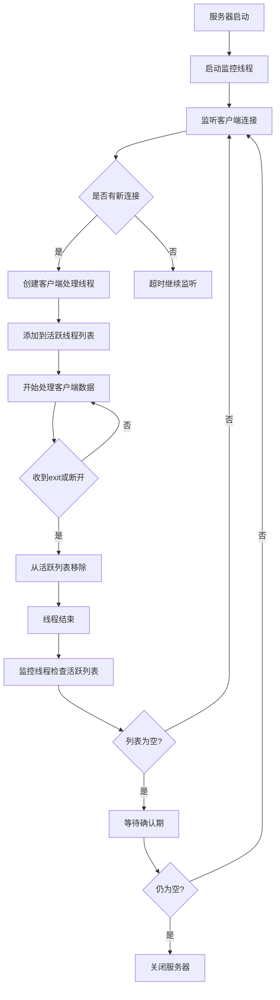

## 1.ip ##

---

### 1.1 ip概念 ###    

**ip地址** ：互联网协议地址，用于唯一标识计算机    
**ip地址分类** ：公网ip和内网ip，ipv4和ipv6    
**特殊ip地址** ：127.0.0.1、localhost表示本机ip    
**ip常用命令** ：ipconfig 查看ip, ping 测试ip连通性

### 1.2 Java中获取ip ###    

**获取本机ip** ： ` public static InetAddress getLocalHost() `    
**获取指定ip** ： ` public static InetAddress getByName(String host) `    
**获取ip地址对象** ：

- *对应的主机名*： ` public String getHostName() `
- *应的地址* ： ` public String getHostAddress() `

**指定时间内能否连通** ： ` public boolean isReachable(int timeout) `

---

## 2.端口号 ##    

### 2.1 端口号概念 ###

**端口号** ：计算机网络中用于标识计算机进程的数字,范围0-65535
> 0-1023为特殊端口，1024-49151为用户端口，49152-65535为系统端口    
> 一个设备中应用程序不能使用相同的端口号。

---

## 3.协议  ##

*用到的java包：java.net.*    

## 3.1 UDP协议 ## 

**1.UDP**　：
- *特点*：用户数据报协议，无连接，数据不可靠，速度快；
- *包含数据*：源ip、源端口、目的ip、目的端口、数据（64KB内）
- *应用*：语音通话，视频直播...

**2.Java中相关代码** ：
- *创建客户端的socket对象（随机分配端口）* ： ` DatagramSocket socket = new DatagramSocket(); `
- *创建服务器的socket对象（指定自身端口）* ： ` DatagramSocket socket = new DatagramSocket(int port); `
- *创建数据包对象* ： ` DatagramPacket packet = new DatagramPacket(byte[] data, int data.length, InetAddress address, int port); ` 
- *发送数据包* ： ` socket.send(DatagramPacket packet); `
- *接收数据包* ： ` socket.receive(DatagramPacket packet); `
- *获取数据* ： ` byte[] data = packet.getData(); `
- *数据转为字节* ： ` byte[] bytes = 数据.getBytes(); `

>socket对象：Socket 是应用层与 TCP/IP 协议族之间的中间抽象层，它提供了一组标准化的接口，用于实现网络通信。    
>接收数据包：receive方法是阻塞方法，调用该方法会阻塞进程，直到收到数据包。

>ide中多开启动类步骤：右上角修改启动配置->修改选项->允许多开    
>同时不能指定端口，否则报错：端口号重复 
    
## 3.2 TCP协议 ##

**TCP**　：
- *特点*：传输控制协议，有连接(需要建立管道)，数据可靠，传输速度慢
- *三次握手*：SYN、SYN+ACK、ACK 建立连接
- *四次挥手*：FIN、FIN+ACK、ACK、RST 断开连接
- *应用*：网页、邮件传输、文件下载...

**java中相关代码** ：
- *创建客户端的socket对象* ： ` Socket clientSocket = new Socket(InetAddress address, int port); `
- *创建服务器的socket对象* ： ` ServerSocket serverSocket = new ServerSocket(int port); `
- *服务端等待客户端连接（阻塞方法）* ： ` Socket socket = serverSocket.accept(); `*
- *获得字节输出流对象* : ` OutputStream outputStream = socket.getOutputStream(); `
- *获得字节输入流对象* : ` InputStream inputStream = socket.getInputStream(); `

---

## 4.TCP通信实例分析 ##

### 4.1 动态多客户端TCP服务器实现 ###

为了实现支持动态数量客户端连接的TCP服务器，采用了多线程技术和动态管理机制：

#### 4.1.1 核心组件设计

1. **主服务器线程**：
   - 创建ServerSocket并绑定端口
   - 持续监听并接受客户端连接请求（设置超时以避免永久阻塞）
   - 为每个新连接的客户端创建独立的处理线程
   - 维护活跃客户端线程列表

2. **客户端处理线程**：
   - 每个线程负责与一个特定客户端进行通信
   - 独立地接收和处理该客户端发送的数据
   - 不会因为处理一个客户端的数据而阻塞其他客户端
   - 在线程结束时从活跃线程列表中移除自己

3. **服务器监控线程**：
   - 后台守护线程，定期检查服务器状态
   - 当没有活跃客户端连接时，触发服务器关闭流程
   - 实现优雅的服务关闭机制

#### 4.1.2 通信流程



#### 4.1.3 特性与优势

1. **动态客户端支持**：
   - 支持任意数量的客户端连接
   - 客户端可以在任何时候加入或离开
   - 服务器持续运行，不受客户端数量限制

2. **高效并发处理**：
   - 每个客户端拥有独立的处理线程
   - 客户端间互不干扰，数据可以即时处理和显示
   - 提供良好的并发性能

3. **智能关闭机制**：
   - 当没有客户端连接时，进入预备关闭状态
   - 经过二次确认（等待5秒）后才真正关闭服务器
   - 避免误关闭，提高服务稳定性

4. **异常处理**：
   - 客户端异常断开时能够正确清理资源
   - 网络异常情况下保证服务器稳定运行
   - 完善的错误日志记录

### 4.2 固定双客户端TCP服务器对比

之前的固定双客户端实现存在明显局限：
1. 只能处理预设数量的客户端（两个）
2. 必须等待所有客户端都连接后才能开始工作
3. 任一客户端断开都会影响服务逻辑
4. 服务器关闭条件不够灵活

动态多客户端实现克服了上述缺点，提供了更好的扩展性和稳定性。

## 5.UDP通信实例分析 ##

### 5.1 UDP服务器的特点 ###

UDP是一种无连接的协议，这意味着UDP服务器与TCP服务器在处理客户端方面有显著的不同：

1. **无连接特性**：
   - UDP服务器不需要为每个客户端建立专门的连接
   - 同一个UDP套接字可以接收来自任何客户端的数据包
   - 服务器不会因为某个客户端断开而受到影响

2. **改进后的UDP服务器行为**：
   ```mermaid
   graph TD
   A[UDP服务器启动] --> B[监听端口等待数据包]
   B --> C[接收到来自客户端1的数据包]
   C --> D[处理数据并显示]
   D --> E{是否为exit命令}
   E -->|否| B
   E -->|是| F[标记客户端1断开]
   F --> B
   B --> G[接收到来自客户端2的数据包]
   G --> H[处理数据并显示]
   H --> I{是否为exit命令}
   I -->|否| B
   I -->|是| J[标记客户端2断开]
   J --> B
   ```

3. **改进要点**：
   - 服务器持续运行，不会因为单个客户端发送"exit"而停止
   - 正确处理数据包中的实际数据长度，避免缓冲区问题
   - 对于"exit"命令，仅标记对应客户端断开，不影响其他客户端通信
   - 服务器保持监听状态，随时准备接收新的数据包

### 5.2 与原始实现的区别 ###

原始的UDP服务器实现在收到任何"exit"命令后就会完全终止服务进程，这是一种不合理的设计，因为：

1. **违反UDP协议特性**：UDP是无连接的，不应该因为单个客户端的行为影响整个服务器
2. **降低服务可用性**：一个客户端断开不应该影响其他客户端的正常使用
3. **资源利用不当**：服务器进程频繁启停浪费系统资源

改进后的实现遵循了UDP协议的本质特征，提供了更好的稳定性和用户体验。
