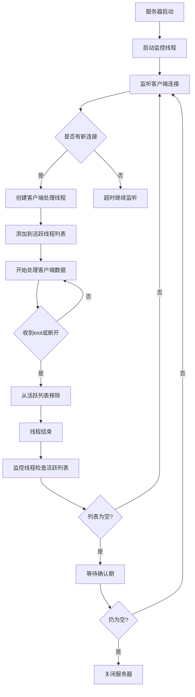

# 网络通信详解

## 1. IP地址

---

### 1.1 IP概念

**IP地址**：互联网协议地址，用于唯一标识计算机  
**IP地址分类**：公网IP和内网IP，IPv4和IPv6  
**特殊IP地址**：127.0.0.1、localhost表示本机IP  
**IP常用命令**：ipconfig 查看IP, ping 测试IP连通性

### 1.2 Java中获取IP

**获取本机IP**：`public static InetAddress getLocalHost()`  
**获取指定IP**：`public static InetAddress getByName(String host)`  
**获取IP地址对象**：

- *对应的主机名*：`public String getHostName()`
- *对应的地址*：`public String getHostAddress()`

**指定时间内能否连通**：`public boolean isReachable(int timeout)`

---

## 2. 端口号

### 2.1 端口号概念

**端口号**：计算机网络中用于标识计算机进程的数字，范围0-65535
> 0-1023为特殊端口，1024-49151为用户端口，49152-65535为系统端口  
> 一个设备中应用程序不能使用相同的端口号。

---

## 3. 网络协议

*用到的Java包：java.net.*

## 3.1 UDP协议

### 特点
- **用户数据报协议**：无连接，数据不可靠，速度快
- **包含数据**：源IP、源端口、目的IP、目的端口、数据（64KB内）
- **应用场景**：语音通话，视频直播等实时性要求高的场景

### Java中相关API
- *创建客户端的Socket对象（随机分配端口）*：`DatagramSocket socket = new DatagramSocket();`
- *创建服务器的Socket对象（指定自身端口）*：`DatagramSocket socket = new DatagramSocket(int port);`
- *创建数据包对象*：`DatagramPacket packet = new DatagramPacket(byte[] data, int data.length, InetAddress address, int port);`
- *发送数据包*：`socket.send(DatagramPacket packet);`
- *接收数据包*：`socket.receive(DatagramPacket packet);`
- *获取数据*：`byte[] data = packet.getData();`
- *数据转为字节*：`byte[] bytes = 数据.getBytes();`

> **Socket对象**：Socket 是应用层与 TCP/IP 协议族之间的中间抽象层，它提供了一组标准化的接口，用于实现网络通信。  
> **接收数据包**：receive方法是阻塞方法，调用该方法会阻塞进程，直到收到数据包。

> **IDE中多开启动类步骤**：右上角修改启动配置->修改选项->允许多开  
> **注意**：同时不能指定端口，否则报错：端口号重复

## 3.2 TCP协议

### 特点
- **传输控制协议**：有连接(需要建立管道)，数据可靠，传输速度慢
- **三次握手**：SYN、SYN+ACK、ACK 建立连接
- **四次挥手**：FIN、FIN+ACK、ACK、RST 断开连接
- **应用场景**：网页、邮件传输、文件下载等可靠性要求高的场景

### Java中相关API
- *创建客户端的Socket对象*：`Socket clientSocket = new Socket(InetAddress address, int port);`
- *创建服务器的Socket对象*：`ServerSocket serverSocket = new ServerSocket(int port);`
- *服务端等待客户端连接（阻塞方法）*：`Socket socket = serverSocket.accept();`
- *获得字节输出流对象*：`OutputStream outputStream = socket.getOutputStream();`
- *获得字节输入流对象*：`InputStream inputStream = socket.getInputStream();`

---

## 4. TCP通信实例分析

### 4.1 动态多客户端TCP服务器实现

为了实现支持动态数量客户端连接的TCP服务器，采用了多线程技术和动态管理机制：

#### 4.1.1 核心组件设计

1. **主服务器线程**：
   - 创建ServerSocket并绑定端口
   - 持续监听并接受客户端连接请求（设置超时以避免永久阻塞）
   - 为每个新连接的客户端创建独立的处理线程
   - 维护活跃客户端线程列表

2. **客户端处理线程**：
   - 每个线程负责与一个特定客户端进行通信
   - 独立地接收和处理该客户端发送的数据
   - 不会因为处理一个客户端的数据而阻塞其他客户端
   - 在线程结束时从活跃线程列表中移除自己

3. **服务器监控线程**：
   - 后台守护线程，定期检查服务器状态
   - 当没有活跃客户端连接时，触发服务器关闭流程
   - 实现优雅的服务关闭机制

#### 4.1.2 通信流程



#### 4.1.3 特性与优势

1. **动态客户端支持**：
   - 支持任意数量的客户端连接
   - 客户端可以在任何时候加入或离开
   - 服务器持续运行，不受客户端数量限制

2. **高效并发处理**：
   - 每个客户端拥有独立的处理线程
   - 客户端间互不干扰，数据可以即时处理和显示
   - 提供良好的并发性能

3. **智能关闭机制**：
   - 当没有客户端连接时，进入预备关闭状态
   - 经过二次确认（等待5秒）后才真正关闭服务器
   - 避免误关闭，提高服务稳定性

4. **异常处理**：
   - 客户端异常断开时能够正确清理资源
   - 网络异常情况下保证服务器稳定运行
   - 完善的错误日志记录

### 4.2 固定双客户端TCP服务器对比

之前的固定双客户端实现存在明显局限：
1. 只能处理预设数量的客户端（两个）
2. 必须等待所有客户端都连接后才能开始工作
3. 任一客户端断开都会影响服务逻辑
4. 服务器关闭条件不够灵活

动态多客户端实现克服了上述缺点，提供了更好的扩展性和稳定性。

## 5. UDP通信实例分析

### 5.1 UDP服务器的特点

UDP是一种无连接的协议，这意味着UDP服务器与TCP服务器在处理客户端方面有显著的不同：

1. **无连接特性**：
   - UDP服务器不需要为每个客户端建立专门的连接
   - 同一个UDP套接字可以接收来自任何客户端的数据包
   - 服务器不会因为某个客户端断开而受到影响

2. **改进后的UDP服务器行为**：
   ```mermaid
   graph TD
   A[UDP服务器启动] --> B[监听端口等待数据包]
   B --> C[接收数据包]
   C --> D[解析数据包来源信息]
   D --> E[处理数据内容]
   E --> F{是否为exit命令}
   F -->|是| G[标记客户端断开]
   F -->|否| H[正常处理数据]
   G --> H
   H --> I[继续监听]
   I --> C
   ```

3. **改进要点**：
   - 服务器持续运行，不会因为单个客户端发送"exit"而停止
   - 正确处理数据包中的实际数据长度，避免缓冲区问题
   - 对于"exit"命令，仅标记对应客户端断开，不影响其他客户端通信
   - 服务器保持监听状态，随时准备接收新的数据包

### 5.2 与原始实现的区别

原始的UDP服务器实现在收到任何"exit"命令后就会完全终止服务进程，这是一种不合理的设计，因为：

1. **违反UDP协议特性**：UDP是无连接的，不应该因为单个客户端的行为影响整个服务器
2. **降低服务可用性**：一个客户端断开不应该影响其他客户端的正常使用
3. **资源利用不当**：服务器进程频繁启停浪费系统资源

改进后的实现遵循了UDP协议的本质特征，提供了更好的稳定性和用户体验。

## 6. 源代码参考

### 6.1 TCP客户端源码

```java
package main.java.itzpy.test.TCP;

import java.io.DataOutputStream;
import java.io.IOException;
import java.io.OutputStream;
import java.net.InetAddress;
import java.net.Socket;
import java.util.Scanner;

public class Client {
    public static void main(String[] args) throws IOException {
        System.out.println("Client开始发送数据");
        //创建客户端套接字
        Socket socket = new Socket(InetAddress.getLocalHost(), 8888);
        //创建数据输出流对象
        OutputStream outputStream = socket.getOutputStream();
        DataOutputStream dataOutputStream = new DataOutputStream(outputStream);
        //写数据
        while ( true){
            System.out.println("请输入数据：");
            Scanner scanner = new Scanner(System.in);
            String data = scanner.nextLine();

            dataOutputStream.writeUTF(data);

            if(data.equals("exit")){
                dataOutputStream.close();
                break;
            }
        }

        socket.close();
    }
}
```

### 6.2 TCP服务端源码

```java
package main.java.itzpy.test.TCP;

import java.io.DataInputStream;
import java.io.IOException;
import java.io.InputStream;
import java.net.ServerSocket;
import java.net.Socket;
import java.util.ArrayList;
import java.util.List;
import java.util.concurrent.CopyOnWriteArrayList;

public class Service {
    // 存储活动的客户端线程
    private static final List<Thread> clientThreads = new CopyOnWriteArrayList<>();
    private static volatile boolean serverRunning = true;

    public static void main(String[] args) throws IOException {
        System.out.println("Service开始接收数据");
        //创建服务端套接字
        ServerSocket serverSocket = new ServerSocket(8888);

        // 启动一个监控线程，用来检测是否需要关闭服务器
        Thread monitorThread = new Thread(new ServerMonitor());
        monitorThread.setDaemon(true);
        monitorThread.start();

        // 主线程持续接收客户端连接
        int clientCounter = 1;
        while (serverRunning) {
            try {
                // 设置接受连接的超时时间，避免无限期阻塞
                serverSocket.setSoTimeout(5000); // 5秒超时
                Socket socket = serverSocket.accept();
                
                // 为新客户端创建处理线程
                String clientId = "Client" + clientCounter++;
                Thread clientThread = new Thread(new ClientHandler(socket, clientId));
                clientThreads.add(clientThread);
                clientThread.start();
                
                System.out.println("新客户端连接: " + clientId + " 来自 " + socket.getInetAddress().getHostAddress());
            } catch (java.net.SocketTimeoutException e) {
                // 超时继续循环，检查serverRunning状态
                continue;
            }
        }

        // 关闭TCP服务器套接字
        serverSocket.close();
        System.out.println("服务端已关闭");
    }

    static class ClientHandler implements Runnable {
        private final Socket socket;
        private final String clientId;
        private boolean closed = false;

        public ClientHandler(Socket socket, String clientId) {
            this.socket = socket;
            this.clientId = clientId;
        }

        @Override
        public void run() {
            try {
                //获取输入流
                InputStream is = socket.getInputStream();
                DataInputStream dis = new DataInputStream(is);

                //读取数据
                while (!closed) {
                    try {
                        String data = dis.readUTF();
                        System.out.println(clientId + ": " + data);
                        System.out.println("来自IP地址: " + socket.getInetAddress().getHostAddress());
                        System.out.println("--------------------------");

                        if (data.equals("exit")) {
                            closed = true;
                            dis.close();
                        }
                    } catch (IOException e) {
                        // 客户端异常断开
                        System.out.println(clientId + " 异常断开连接");
                        closed = true;
                    }
                }

                socket.close();
                System.out.println(clientId + " 已断开连接");
            } catch (IOException e) {
                if (!closed) {
                    System.out.println(clientId + " 处理过程中发生错误: " + e.getMessage());
                }
            } finally {
                // 从活动线程列表中移除当前线程
                Thread currentThread = Thread.currentThread();
                clientThreads.remove(currentThread);
            }
        }
    }

    static class ServerMonitor implements Runnable {
        @Override
        public void run() {
            while (true) {
                try {
                    Thread.sleep(5000); // 每5秒检查一次
                    
                    // 如果没有活动的客户端线程，则关闭服务器
                    if (clientThreads.isEmpty()) {
                        System.out.println("没有活动客户端，服务器将在下次检查时关闭...");
                        Thread.sleep(5000); // 再等待5秒确认
                        
                        // 再次检查是否仍然没有客户端
                        if (clientThreads.isEmpty()) {
                            System.out.println("确认没有客户端连接，关闭服务器...");
                            serverRunning = false;
                            break;
                        }
                    }
                } catch (InterruptedException e) {
                    break;
                }
            }
        }
    }
}
```

### 6.3 UDP客户端源码

```java
package main.java.itzpy.test.UDP;

import java.io.IOException;
import java.net.DatagramPacket;
import java.net.DatagramSocket;
import java.net.InetAddress;
import java.util.Scanner;

public class Client {
    public static void main(String[] args) throws IOException {
        System.out.println("Client开始发送数据");

        //创建套接字，把要传送的数据转为byte[]封装进数据报，发送，关闭套接字。
        DatagramSocket socket = new DatagramSocket();

        String  data = new String("");

        //循环发送数据
        while (!data.equals("exit")){
            Scanner scanner = new Scanner(System.in);

            System.out.println("请输入数据：");
            data = scanner.nextLine();
            byte[] bytes = data.getBytes();

            DatagramPacket datagramPacket = new DatagramPacket(bytes, bytes.length, InetAddress.getLocalHost(), 8888);

            socket.send(datagramPacket);

        }

        socket.close();
        System.out.println("发送完毕");
    }
}
```

### 6.4 UDP服务端源码

```java
package main.java.itzpy.test.UDP;

import java.io.IOException;
import java.net.DatagramPacket;
import java.net.DatagramSocket;

public class Service {
    public static void main(String[] args) throws IOException {
        System.out.println("Service开始接收数据");

        DatagramSocket socket = new DatagramSocket(8888);

        while (true)
        {
            byte[] buffer = new byte[1024 * 64];

            DatagramPacket packet = new DatagramPacket(buffer, buffer.length);

            socket.receive(packet);

            // 不能这么写，没考虑到缓冲区中未输入的数据也会被读取。
            /*if(new String(packet.getData()).equals("exit")){
                break;
            }*/
            // 修改后
            String receivedData = new String(packet.getData(), 0, packet.getLength());
            if(receivedData.trim().equals("exit")){
                System.out.println("收到退出指令，来自：" + packet.getAddress().getHostAddress() + ":" + packet.getPort());
                // 不终止整个服务，只是输出信息
                System.out.println("客户端 " + packet.getAddress().getHostAddress() + ":" + packet.getPort() + " 已断开连接");
                continue; // 继续监听其他数据包
            }

            System.out.println("接收到数据: " + new String(packet.getData(), 0, packet.getLength()));
            System.out.println("来源IP: " + packet.getAddress().getHostAddress());
            System.out.println("来源端口: " + packet.getPort());
            System.out.println("------------------------");
        }

        // 不会到达这里，因为这是UDP服务，通常一直运行
        // socket.close();
    }
}
```
